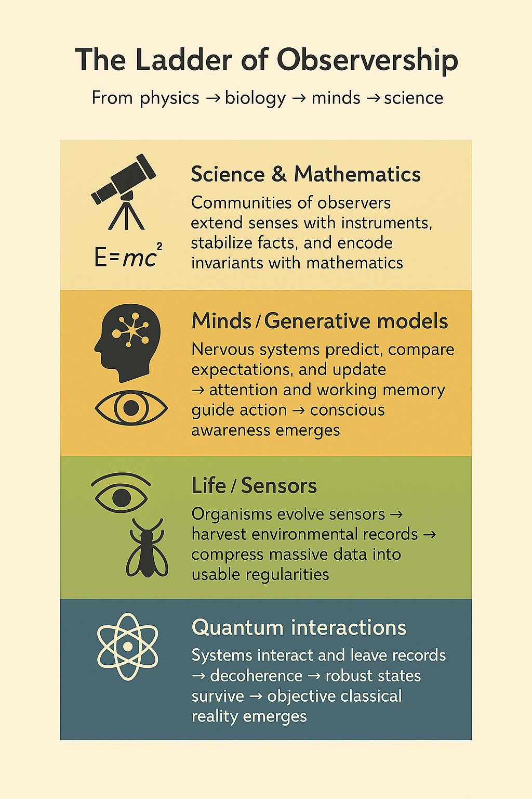

Of course. This is a well-structured and insightful piece of writing. The improvements below aim to sharpen the language, enhance the flow, and add a bit of rhetorical polish to make the core arguments even more compelling.

Here is the revised version:

-----

# Observership: How a Universe, a Mind, and Mathematics Meet

Imagine three doors in a grand hallway, an image borrowed from Roger Penrose’s *The Road to Reality*.

Behind the first is the **Mathematical World**: a timeless realm of symmetries, numbers, and proofs—truths that seem to exist outside of reality.
Behind the second is the **Physical World**: the fabric of spacetime, fields, and matter, where everything moves and collides.
Behind the third is the **Mental World**: the inner universe of awareness, meaning, and the feeling of understanding.

Penrose highlights the three great mysteries that bridge these realms:

1.  **The Efficacy of Mathematics:** Why does the abstract language of mathematics describe the physical world with such uncanny accuracy?
2.  **The Origin of Mind:** How can mindless matter organize itself to produce conscious, subjective experience?
3.  **The Accessibility of Truth:** How do finite minds gain access to the infinite and timeless truths of mathematics?

His picture is a static puzzle: three distinct worlds, linked by three profound riddles.

Now, consider a different architecture, designed by Stephen Hawking and Thomas Hertog in *On the Origin of Time*. Their model is also a triangle, but it is **dynamic**, not static—a process, not a state:

  * **Origin:** The universe did not begin with fixed, eternal laws. In its earliest moments, the rules of reality themselves were in flux.
  * **Evolution:** As the cosmos expanded and cooled, laws and structures co-evolved, with stable regularities crystalizing out of the quantum foam.
  * **Observership:** Observers are not incidental latecomers; we are participants. Our existence helps **select** which cosmic histories become definite and measurable.

Where Penrose shows three rooms, Hawking and Hertog map a process of creation. Instead of asking how three finished worlds interlock, they ask: **How do worlds take shape in a universe that is learning its own rules?**

The master key that unlocks Penrose’s rooms and animates the Hawking-Hertog model is a single concept: **observership**.

-----

## The Ladder of Observership

This ladder rises from physics to culture, showing observership as a continuous process of information handling.

**Rung 1: Quantum Recording.** At the base, quantum systems interact with their environment, leaving records—correlations that spread outward through decoherence. Only robust "pointer states" can be redundantly copied, creating the shared, classical reality that multiple observers can agree upon.

**Rung 2: Biological Sensing.** Life evolves to exploit these records. Organisms develop sensors—retinas for photons, antennae for chemicals—that harvest information. They compress a torrent of data into useful regularities that guide survival.

**Rung 3: Cognitive Modeling.** Nervous systems become generative modelers. They don't just sense; they predict, compare expectations with reality, and update their internal models. Consciousness acts as the control surface for this process, directing attention and integrating information. Minds don't just register; they **theorize**.

**Rung 4: Scientific & Mathematical Abstraction.** Communities of observers build instruments to extend the senses, methods to stabilize facts, and a symbolic language—**mathematics**—that captures the universe's deep invariants with breathtaking economy.

From bottom to top, observership is the registration, compression, and sharing of information—a continuous thread weaving through physics, biology, and culture.

-----

## Reframing Penrose’s Three Mysteries

With this ladder in hand, the mysteries no longer look like paradoxes.

### 1\. *Why does mathematics fit nature so well?* (Mathematical → Physical)

In the Hawking-Hertog view, physical laws are not timeless decrees; they are the **stable survivors** of cosmic evolution. The universe favors regularities that can persist and be redundantly recorded. Biological and scientific observers then **latch onto** these same patterns because they are predictively powerful and compressible.

Mathematics "fits" nature because **mathematics and physical lawfulness co-evolved** within observer-permitting histories. We inhabit a branch of the cosmos where compact, readable structure is abundant—this is the very condition for our existence.

*The mystery dissolves into an expectation: where observers can arise, mathematics will be effective.*

-----

### 2\. *How can matter yield mind?* (Physical → Mental)

Follow the ladder. Quantum interactions create records. Organisms evolve to exploit them. This modeling of the world grows deeper and more abstract until a sophisticated control surface we call **consciousness** emerges. In a participatory cosmos, observers are not afterthoughts; their modeling activity helps crystallize which macroscopic histories remain in play.

Mind is not an alien spark added to matter; it is **matter that has learned to model itself and its world**. The hard problem of consciousness shifts from a metaphysical chasm to a question about the continuity of mechanisms—recording, predicting, coordinating—stacked across scales.

*The mystery becomes a question of continuity: mind is the highest rung on a ladder that begins with physical recording.*

-----

### 3\. *How do minds access mathematical truth?* (Mental → Mathematical)

Minds evolved to find and track **invariants** in an environment full of stable patterns. Mathematics is the ultimate toolkit for this task: numbers for quantity, geometry for form, symmetry for conservation. The cultural processes of proof, peer review, and instrumentation create an **intersubjective convergence**, giving mathematics its powerful aura of timeless, objective truth.

In this view, there is no need to postulate a separate Platonic realm. Our access to mathematics is **contextual and cumulative**: we grasp the mathematical structures that co-stabilized with our branch of the universe and with our own practices of observation.

*The mystery becomes a question of method: we "discover" mathematical truths because our cognition is tuned to the very same stable patterns that make observation itself possible.*

-----

## The Power of the Dynamic View

The Hawking-Hertog framework transforms the puzzle:

  * **Origin** implies there is no single, fixed past. Lawful structure **condenses** from a fog of quantum possibilities.
  * **Evolution** reveals that robustness, redundancy, and compressibility are **selected for** at every level—cosmic, biological, and cultural.
  * **Observership** dictates that the histories we can inhabit are precisely those where such structure can be **recorded, modeled, and shared**.

Penrose’s three arrows seem mysterious only if his three worlds are taken as **given**. They become natural if the worlds are understood as **grown**—sculpted by the same informational principles that make observers possible.

-----

## The Integrated Picture

Imagine Penrose’s static triangle nested inside a larger, dynamic process: **Origin → Evolution → Observership**. This outer process breathes life into the inner connections.

  * The **Mathematical → Physical** link is explained because *mathematics co-evolves with physical laws.*
  * The **Physical → Mental** link is explained because *mind is the apex of observership in matter.*
  * The **Mental → Mathematical** link is explained because *minds evolve to track the invariants that the universe and our methods stabilize.*

The result is not a final proof but a **coherent narrative**: mathematics, mind, and nature are different facets of the same informational process, maturing together inside an observer-permitting cosmos. Observership shows Penrose's three mysteries not as disconnected enigmas, but as three perspectives on a single, evolving conversation between the universe and the minds that learn to read—and eventually write—its laws.

-----

## Coda: The Practice of World-Building

At its heart, observership is a practice that **stabilizes shareable worlds**. Physical interactions leave traces; scientific methods compress and test them; communities of inquiry verify what holds true. On this view, objectivity is not a pre-existing fact; it is **what survives translation, stress, and time**.

The fundamental unit is not a lone observer but an **observer–system–protocol loop**: a target of study, tools for sensing, procedures for catching error, and norms for revision. When these loops hold, the regularities they track appear to us as "laws of nature."

This pattern repeats across all domains of inquiry:

  * In **logic**, proofs and model-checking secure stable inferences.
  * In **ecology**, satellite data, field plots, and acoustic monitoring converge to reveal planetary dynamics.
  * In **art**, the practice of observing-as-making widens the human sensorium to find new invariants of form and feeling.

Because our practices harden raw phenomena into facts, **method is always ethical**. The charge is to multiply our paths to knowledge, triangulate across unlike observers, report uncertainty honestly, and always watch how the act of measuring changes the world.

Whether observership is ultimately emergent from physics or a primitive feature of reality, the program remains the same: add observers that disagree in kind, demand hard convergence, and let the widest possible sensorium decide how far the ladder of understanding can go.
