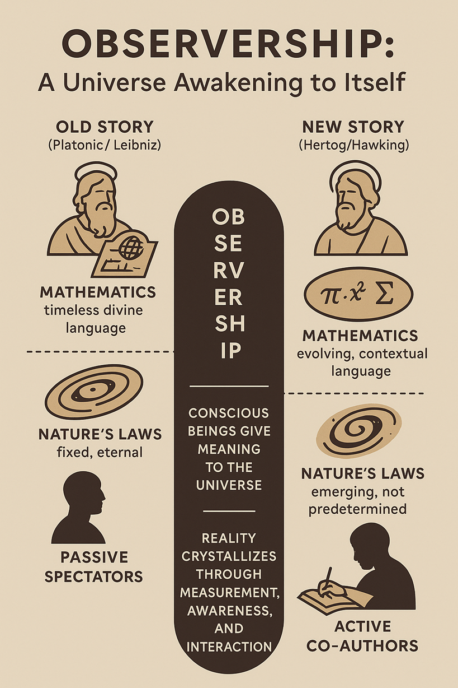

# **Observership: The Universe Awakening to Itself**

## **1. The old story: a timeless universe**

For centuries, humanity lived under the vision of a **perfect, predetermined cosmos**.
In the tradition of **Plato** and **Leibniz**, the universe was believed to be **static, complete, and harmonious**:

* God, the **divine architect**, designed the best of all possible worlds.
* The **laws of nature** were **eternal and unchanging**.
* Mathematics was the **language of God** — a timeless key to decode His perfect plan.
* Human beings were **spectators**: we did not shape the universe; we merely **discovered** it.

This is the **Platonic dream**: reality as a flawless blueprint, mathematics as the divine script, and God as the architect outside time.

But this story is now collapsing.

---

## **2. A new story emerges: a universe in motion**

In *On the Origin of Time*, **Thomas Hertog** — building on his final collaboration with **Stephen Hawking** — proposes something revolutionary:
The universe did **not** begin with fixed laws.

* In the earliest moments, **space, time, and the laws themselves were fluid**.
* The cosmos did not **follow** a timeless script — it **wrote** itself.
* Physics is not absolute; it **evolves** as the universe unfolds.

This is a profound shift: the universe is **not a finished structure** but a **living process**.
The story is **not fixed**. It is **becoming**.

---

## **3. Mathematics: from divine code to living language**

In this dynamic universe, **mathematics** takes on a completely new role.

For **Leibniz**, mathematics revealed God’s **eternal blueprint**:

* The equations we write down are timeless.
* They exist **before us**, independent of our minds.
* By doing mathematics, we **discover** the hidden architecture of creation.

For **Hertog**, mathematics is **contextual** and **evolving**:

* There is no single, eternal mathematical structure underlying reality.
* Our equations are **maps**, not scripts — they describe **patterns** within **our specific universe**.
* In other possible universes, with different laws, mathematics itself could look **entirely different**.

Mathematics becomes a **living dialogue** between **conscious beings** and the **cosmos**.
We are not passive readers of a divine manuscript — we are **co-authors of the language**.

---

## **4. Observership: the key to reality**

Here lies Hertog and Hawking’s boldest insight:
**The universe cannot be understood without observers.**

In quantum physics, we already know that **measurement matters**: a system remains a cloud of possibilities until it **interacts** — until something “observes.” Hertog extends this principle to the **cosmos itself**:

* There is **no single fixed history** of the universe.
* There exists a **superposition of possible cosmic paths**.
* **Our presence as observers** determines **which histories are meaningful**.

This doesn’t mean we *create* the universe out of nothing.
It means that **reality crystallizes through interaction**:

> The universe **becomes meaningful** when it is **experienced**.

We are not **detached spectators**. We are **participants**.

---

## **5. God in a dynamic cosmos**

This evolving vision of reality also transforms the **concept of God**.

In the old, Platonic model:

* God was a **perfect architect** outside time.
* The **laws of nature** were His eternal design.
* We, as observers, were **passive** — living inside a fully determined plan.

In Hertog’s model, a **new theological possibility** arises — closer to **process philosophy** and **panentheism**:

* God is not the distant programmer but a **creative presence** **within** the unfolding cosmos.
* Creation is **not finished**; it is **ongoing**.
* Conscious beings — us — may be the universe’s way of **becoming aware of itself**.

This resonates with thinkers like **Teilhard de Chardin**, who saw evolution — of matter, life, and mind — as moving toward greater **complexity** and **self-awareness**, culminating in what he called the **Omega Point**: the point where the universe recognizes itself.

In this view, God is **not outside creation** but **entangled with it**.
God is the **source of becoming**, not the author of a frozen script.

---

## **6. The dance of being: cosmos, mathematics, and us**

When we bring these threads together — Hertog’s cosmology, mathematics, God, and consciousness — a new narrative emerges:

* The **universe is not complete**; it is **emerging**.
* The **laws of physics** are not eternal; they **evolve** with cosmic history.
* **Mathematics** is not a static code; it is a **language that adapts** as the universe grows.
* **Observership** is the bridge: without conscious beings, the cosmos has no “chosen” story.
* And if God exists, God is **not outside the process** — God **moves with it**.

In this story, we are **not passive witnesses**.
We are **active participants** in the universe’s unfolding.
Our consciousness — our ability to measure, describe, and imagine — helps shape **what becomes real**.

---

## **7. Epilogue: the universe awakening**

Leibniz imagined we were reading a perfect book, written by God before time began.
Hertog invites us to imagine something more radical:

> We are **co-writing** the book of the cosmos.
> The letters of mathematics are our ink.
> Our observations give the universe meaning.
> Our stories give the cosmos memory.

Perhaps **observership** is not an accident, but a **necessity** — the way the universe **awakens to itself**.
And maybe, just maybe, this is what people have always meant by being **“made in the image of God.”**

